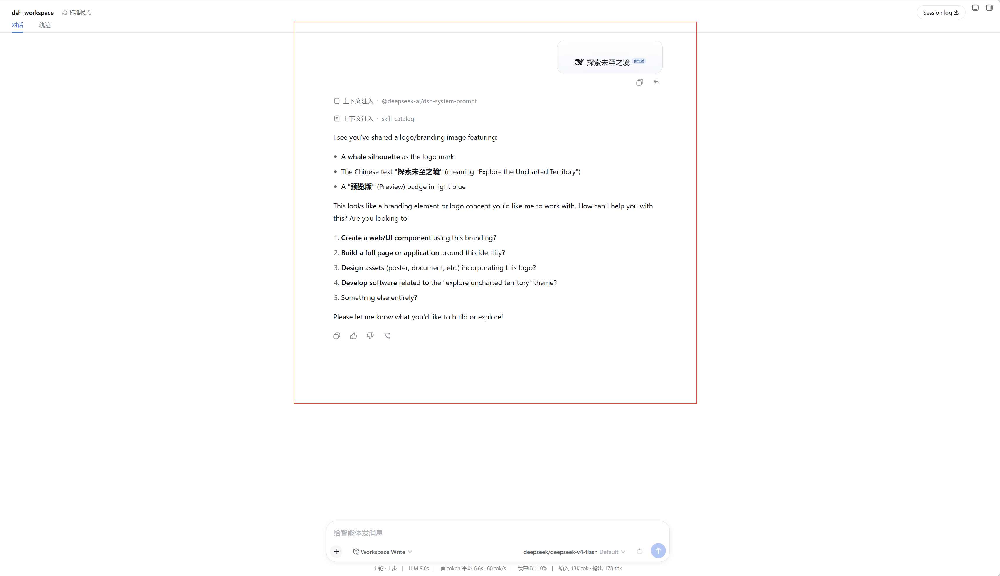
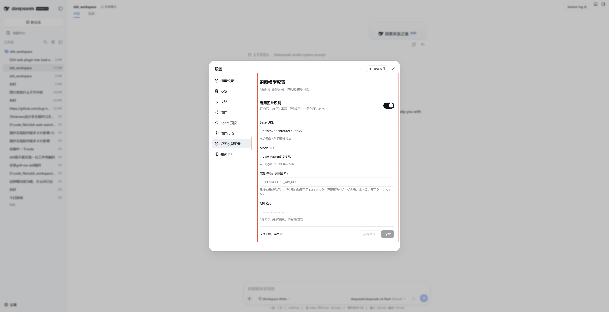

# dsh-vision-plugin

DSH 图片识别插件 — 为 AI 会话添加图片理解能力。

在设置的 **插件** 页面查看识别功能开关，在 **识图模型配置** 页面配置视觉模型的 Base URL、Model ID 和 API Key。

## 安装（通过 DSH 市场）
1. 打开 DSH Web GUI → **设置 → 插件** → **市场**
2. 添加仓库源 `https://github.com/bug-huntter/dsh-vision-plugin`
3. 扫描并安装

## 手动安装
```bash
dsh plugin add dsh-vision-plugin
```

## 效果展示

### ① 插件配置页（设置 → 识图模型配置）



在设置面板左侧导航的「识图模型配置」中，您可以配置：
- **启用图片识别** — 主开关，开启后 AI 可以识别并理解用户上传的图片内容
- **Base URL** — 视觉模型 API 的基础地址
- **Model ID** — 用于视觉任务的模型标识符
- **密钥来源（变量名）** — 环境变量或凭证名，留空自动复用同路由已配置的密钥
- **API Key** — 实际 API 密钥（敏感信息，妥善保管）

### ② 插件列表页（设置 → 插件）



在「设置 → 插件」面板中，您可以看到「图片识别功能」卡片，展示插件的启停状态与基本信息。

## 支持的服务

插件内部只做一次标准的 **OpenAI 兼容** `POST {baseUrl}/chat/completions` 请求（`Authorization: Bearer <key>`），因此**不限于 OpenRouter**。任何提供 OpenAI 兼容 `/chat/completions` 接口的服务都可用：

| 服务 | Base URL 示例 | 模型 ID 示例 |
|---|---|---|
| OpenRouter | `https://openrouter.ai/api/v1` | `qwen/qwen3.8-27b`、`openai/gpt-4o-vision` |
| OpenAI | `https://api.openai.com/v1` | `gpt-4o` |
| 火山方舟 ARK（Agent Plan / Coding Plan） | `https://ark.cn-beijing.volces.com/api/plan/v3` | `Doubao-Seed-Evolving`、`doubao-seed-evolving-latest-version` |
| 本地 / 自建 OpenAI 兼容网关 | `http://<host>:<port>/v1` | 服务端已部署的模型 ID |

> 用聚合平台（OpenRouter / ARK）时，模型名需使用该平台登记的完整标识符；`baseUrl` 填到**不含** `/chat/completions` 的根地址，插件会自动拼接。

## 安装

### 前置条件

- 已安装 [DSH](https://github.com/deepseek-ai/dsh)（版本 ≥ rc.7）
- 可用的视觉模型 API 端点（如 OpenRouter、OpenAI-compatible 服务）

### 步骤

#### 1. 安装插件包

```bash
# 从 npm registry 安装（推荐）
dsh plugin add dsh-vision-plugin
```

#### 2. 启动/重启 DSH Web

```bash
pnpm dsh web
```

#### 3. 配置视觉模型

在打开的设置页中：

1. 进入 **设置 → 识图模型配置**
2. 填写 **Base URL**（如 `https://openrouter.ai/api/v1`）
3. 填写 **Model ID**（如 `qwen/qwen3.8-27b`）
4. **把密钥填到「API Key」字段**——不要把 key 填进「密钥来源（变量名）」字段（那是环境变量/凭证名，不是 key 本身）
5. 开启 **启用图片识别** 开关
6. 点击 **保存**

**火山方舟 ARK 示例**（Agent Plan / Coding Plan 实测可用）：

| 字段 | 值 |
|---|---|
| Base URL | `https://ark.cn-beijing.volces.com/api/plan/v3` |
| Model ID | `Doubao-Seed-Evolving` |
| API Key | `ark-xxxxxxxx-xxxx-xxxx-xxxx-xxxxxxxxxxxx` |
| 密钥来源（变量名） | 留空 |

> **注意**：使用 OpenRouter 等聚合 API 时，模型名需使用该平台的完整标识符（如 `openai/gpt-4o-vision`、`qwen/qwen3.8-27b`）。

#### 4. 验证

在对话中向 AI 发送一张图片，确认它能正常识别图片内容。

## 常见问题（FAQ）

### 报错 `401 The API key format is incorrect`（或 `AuthenticationError`）

**原因**：插件实际发给服务端的 key 不是当前填写的那一个。最常见的情况是——把 key 填进了 **「密钥来源（变量名）」** 字段，或之前保存过别的 key 但未更新。插件会按以下优先级取 key：

1. `apiKeyEnv`（密钥来源/变量名）——填的是**变量名或凭证名**（如 `OPENROUTER_API_KEY`、`A2W_API_KEY`），不是 key 本身；解析失败则跳过
2. 复用同 Base URL 路由已注册的模型 key（`baseUrl` 需与某个已配置模型的路由完全一致）
3. 字面量 `apiKey`（**API Key** 字段）

若 1、2 均未命中而 `apiKey` 又为空，请求就会带一个旧/空 key 过去，被服务端以 401 拒绝。

**修复**：把 key 直接粘贴进 **API Key** 字段，`密钥来源（变量名）` 留空；保存后**刷新设置页**确认已生效。若你直接改 `~/.dsh/settings.yaml`，`vision-plugin` 段形如：

```yaml
vision-plugin:
  apiKey: ark-xxxxxxxx-xxxx-xxxx-xxxx-xxxxxxxxxxxx   # 或 sk-... / 其他格式
  baseUrl: https://ark.cn-beijing.volces.com/api/plan/v3
  modelId: Doubao-Seed-Evolving
  apiKeyEnv: ""
  enabled: true
```

DSH 的 settings-file 服务默认热加载（`watch: true`），保存文件后即时生效。

### 报错 `400 InvalidParameter: Image dimensions are too small`

ARK 等平台对图片有最小尺寸限制（如 ARK 要求最短边 ≥ 14px）。请发送正常尺寸的图片，不要用 1×1 之类占位图测试。

## 开发

```bash
# 安装依赖
pnpm install

# 构建
pnpm build
```

### 构建产物

| 文件 | 说明 |
|---|---|
| `lib/index.js` | Node 端 — 向 DSH 注册 settings 命名空间 |
| `lib/client.js` | 浏览器端 bundle，被 DSH 插件加载器自动加载 |
| `lib/client.js.map` | Source map |

## 技术原理

1. 通过 **settings section 插槽**在设置页导航中注册「识图模型配置」页面
2. 通过 **plugins tab 插槽**在插件列表注册「图片识别功能」卡片
3. 使用 `SettingsScopeController` 绑定 `vision-plugin` 命名空间实现配置持久化
4. 插件设置命名空间：`vision-plugin`（enabled、baseUrl、modelId、apiKey）

## License

MIT